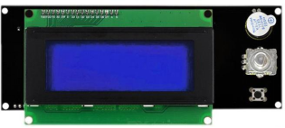
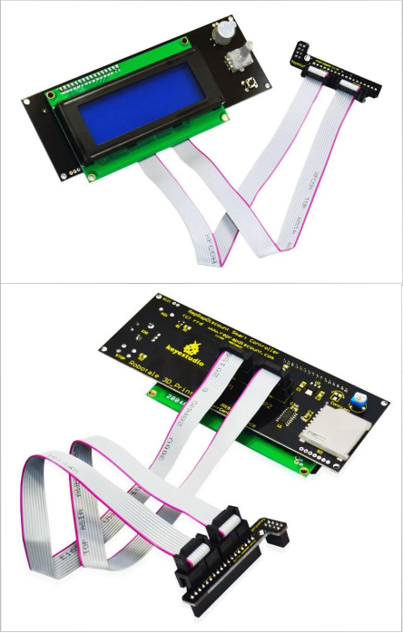

# KS0150 Keyestudio RAMPS1.4 / 2004 LCD Control Panel for 3D Printer

## 1. Introduction

The smart control panel includes a SD card reader, a rotary encoder and a 20 character * 4 line LCD.

When this control panel is connected to RAMPS 1.4, you don’t need your PC anymore. The smart control panel supplies power for your SD card. Further more actions like calibration, axes movements can be done by adjusting the rotary encoder on the Smart Control panel.

With g-code design stored on the SD card, you can print your 3D designs without PC.

## 2. Connection

Note: This product needs to work with connection lead and adapter board.

